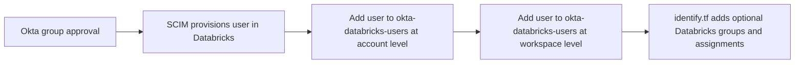
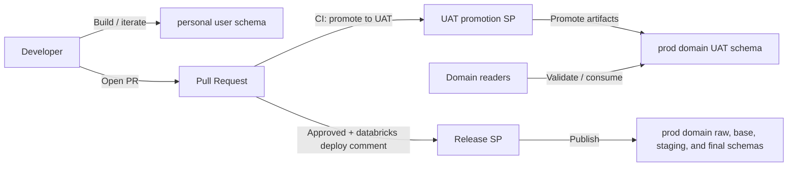

# Architecture

## Unity Catalog (single workspace, Option 1)

This repository currently targets a **single Databricks workspace**. Unity Catalog naming and access control follow an “Option 1” domain model that remains compatible with a future **multi-workspace** posture (multiple workspaces sharing one metastore).

### Namespaces

- **Governed domain catalogs:**
  - `prod_<source>_<business_area>` when `business_area` is present
  - `prod_<source>` when `business_area` is empty
  - Standard schemas: `raw`, `base`, `staging`, `final`, plus `uat`
  - Exception: the default catalog `main` may be managed on the governed path with no schemas
- **Platform governance catalog:** `prod_security`
  - Reserved for access-control support objects such as ABAC policy UDFs, access mapping tables, governance reference data, and audit evidence
  - Conceptual schema layout:
    - `access_maps`: access mapping tables
    - `access_audit`: approval ledger and change-history tables
    - `reference`: governance reference tables
    - `policies`: policy-supporting UDFs/functions
  - Does not inherit normal governed domain-reader access semantics
- **ABAC policy demonstration catalog:**
  - `dev_abac_demo` in the development workspace
  - `prod_abac_demo` in the production workspace
  - Contains only the `protected` schema used to exercise catalog- and schema-scoped policy behavior
  - The environment-specific catalog name is supplied by workspace variables, following the `dev_security`/`prod_security` pattern
- **Personal development catalog:** `personal`
  - Schemas: `personal.<user_key>` for each user present in the workspace-level `okta-databricks-users` group
  - `<user_key>` is derived from the user's normalized email local part (example: `jane.doe@company.com` -> `jane_doe`)

Examples:

- Prod object: `prod_salesforce_revenue.final.customer_dim`
- Prod object without business area: `prod_hubspot.final.company_dim`
- Shareable UAT object: `prod_salesforce_revenue.uat.customer_dim_candidate`
- Platform governance object: `prod_security.access_maps.jira_project_access`
- Policy-supporting function: `prod_security.policies.can_access_region(...)`
- Default schema-less governed catalog: `main`
- Personal build artifact: `personal.jane_doe.customer_dim_candidate`

### Access model (intent)

- Humans write only in `personal.<user_key>`.
- The **UAT promotion** service principal has read/write access to all governed domain `uat` schemas, but **no access** to governed `raw`, `base`, `staging`, or `final` schemas.
- The **release** service principal has full access to all governed `raw`, `base`, `staging`, and `final` schemas.
- Domain readers can read both:
  - governed `prod_*` production-layer schemas
  - governed `prod_*` `uat` schemas
- The governed-path `main` catalog is catalog-level only in this pattern; it intentionally has no schemas.
- The workspace default namespace remains unchanged for now; future recommendation is to set it to `personal` to reduce accidental writes into governed catalogs.
- Each workspace's existing bundle deployment service principal is represented explicitly in Terraform by application ID. It receives `USE_CATALOG` plus `CREATE_TABLE`/`USE_SCHEMA` on the environment's security-catalog `access_maps` schema and `CREATE_FUNCTION`/`USE_SCHEMA` on its `policies` schema.
- The `personal` catalog is enabled only in the personal-development workspace, not in production. Its developer receives `USE_CATALOG` plus create/use privileges only on that developer's personal schema.

Detailed design: `docs/design-docs/unity-catalog.md`

## Identity provisioning

User lifecycle is assumed to be managed outside Terraform through Okta SCIM.

- Approval through the relevant Okta access path provisions the user into Databricks.
- Approved users are automatically added to `okta-databricks-users` at both the Databricks account and workspace levels.
- `infra/aws/dbx/databricks/us-west-1/identify.tf` does not create users. It assigns already provisioned users to additional Terraform-managed Databricks groups when requested.
- Those additional Databricks groups, along with the already provisioned users referenced in `identify.tf`, can carry account roles, workspace permission assignments, and workspace entitlements managed through Terraform.
- The `personal` catalog is expected to create one schema per user based on live membership in the workspace-level `okta-databricks-users` group.
- Automatic membership in `okta-databricks-users` does not, by itself, change Unity Catalog privileges. Unity Catalog access continues to be managed separately through Terraform group definitions and grants.

## Developer experience flow

Notes:

- Before the workflow below starts, the developer must already be provisioned through Okta SCIM and present in `okta-databricks-users` at the account and workspace levels.
- On PR submission, CI automatically promotes shareable artifacts into the target governed domain `uat` schema using the **UAT promotion** service principal (`prod_<source>_<business_area>.uat` when `business_area` is present, otherwise `prod_<source>.uat`).
- After approval, a `"databricks deploy"` comment triggers publish into the governed production layer schemas using the **release** service principal.
- In the single-workspace phase, strict Unity Catalog grants and workspace compute controls are required to prevent accidental writes into governed production layer schemas.

## Future: multi-workspace (shared metastore)

Assumption: all workspaces share **one** Unity Catalog metastore.

- Use workspace-scoped `workspace_id` / `workspace_ids` parameters where appropriate (e.g., metastore assignments and workspace bindings).
- Use workspace bindings so additional workspaces can “see” the same governed `prod_*` catalogs.
- Keep the namespace model and UC grants consistent across workspaces.

## External foundation model serving

Databricks model serving endpoints are workspace-scoped. A serving endpoint created in one workspace does not become a metastore-level object, even when the workspace uses a shared Unity Catalog metastore.

- Phase 1 Bedrock external foundation model serving is managed by `infra/aws/dbx/databricks/us-west-1/modules/databricks_workspace/bedrock_external_model_endpoints`.
- The module creates only the workspace model serving endpoint and authoritative endpoint ACLs.
- The endpoint auth input is currently `instance_profile_arn` because the current root stack provider generation used for this path does not expose `uc_service_credential_name` on the Bedrock external model serving shape used here.
- Do not create Unity Catalog service credentials in this phase; they would be a partially unused control surface until the endpoint resource can consume them.
- The recommended future auth object is a Unity Catalog service credential at the shared metastore, optionally workspace-bound when only selected workspaces should use it.
- Each active workspace that needs `ai_query` access should own its own serving endpoint and endpoint permissions, even when the future auth object is shared at the metastore.
- Databricks agent serving endpoints are a separate workspace serving shape. They can also be queried through `ai_query`, but they are not part of the Phase 1 Bedrock external foundation model endpoint module.
