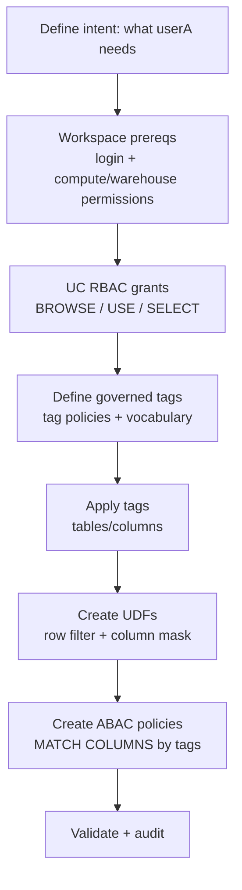

# Access Control (Hybrid: Unity Catalog RBAC + ABAC)

This doc describes a **hybrid** access-control approach for Databricks:

- **Unity Catalog RBAC (privileges)** decides *which* catalogs/schemas/tables userA can query.
- **Unity Catalog ABAC (governed tags + policies)** applies **row filters** and **column masks** inside those objects.
- **Workspace-level permissions** ensure userA can log into the workspace and run queries.

> Scope (per repo rules): **Unity Catalog + workspace-level** only.

## Architecture

- catalogs = `prod_marketing_googleads` & `prod_marketing_salesforce`
- schemas = `<layer>` (`raw` | `base` | `staging` | `final`)

## Scenario

Assume `userA`:

- Has access to **all objects** in `prod_marketing_googleads` across all layers.
- Needs access to a **small allowlist** of objects in `prod_marketing_salesforce` (can be in one schema or mixed across layers).
- Optional: can **discover** Salesforce objects (see metadata) without being able to read data.

## End-to-end flow



## Step-by-step (recommended)

### 0) Define principals (use groups when possible)

Use groups as stable, auditable principals. Example set:

- `marketing_googleads_readers`: read **all** of `prod_marketing_googleads`
- `marketing_salesforce_object_readers`: read **only** an allowlist in `prod_marketing_salesforce`
- `marketing_analysts`: default “readers” that should get masking/filtering policies
- `marketing_pii_clearance`: exempt from PII masking (optional)
- `marketing_us_region`: example row-filter principal (US-only rows)

### 1) Workspace prerequisites (workspace-level)

Ensure `userA` can:

- **Access the workspace** (entitlement / workspace access).
- **Run queries** by being allowed to use at least one compute option your org supports (for example: “Can Use” on a SQL warehouse, or cluster access if you allow that path).

This is independent from Unity Catalog object permissions.

### 2) Optional: metadata-only discoverability (Unity Catalog)

If you want `userA` to **see** objects but not read data, grant `BROWSE` and do **not** grant `SELECT`.

Pseudo-SQL:

```sql
-- Metadata visibility only (no data access):
GRANT BROWSE ON CATALOG prod_marketing_salesforce TO `userA`;
GRANT BROWSE ON SCHEMA prod_marketing_salesforce.raw TO `userA`;
GRANT BROWSE ON TABLE  prod_marketing_salesforce.raw.some_table TO `userA`;
```

Notes:

- `BROWSE` enables visibility in Catalog Explorer, lineage, search, `information_schema`, and APIs without granting data access.
- If you want richer discovery via SQL (for example `SHOW ...`), you may also grant `USE CATALOG` / `USE SCHEMA` while still withholding `SELECT`.

### 3) Unity Catalog RBAC grants (object access)

#### Googleads: broad read across all layers

Grant at catalog + schema levels so `userA` can query across `raw|base|staging|final` without per-table churn.

Pseudo-SQL:

```sql
-- Allow resolving object names:
GRANT USE CATALOG ON CATALOG prod_marketing_googleads TO `marketing_googleads_readers`;

-- For each layer schema:
GRANT USE SCHEMA ON SCHEMA prod_marketing_googleads.raw TO `marketing_googleads_readers`;
GRANT SELECT ON SCHEMA prod_marketing_googleads.raw TO `marketing_googleads_readers`;
```

> Schema-level `SELECT` is useful for “all objects in this layer” because it applies to current and future tables/views in that schema.

#### Salesforce: narrow allowlist read (mixed layers)

Grant only what’s needed:

- `USE CATALOG` on `prod_marketing_salesforce` (so fully-qualified names resolve)
- `USE SCHEMA` only for the layer schemas that contain the allowlisted objects
- `SELECT` only on the allowlisted tables/views

Pseudo-SQL:

```sql
GRANT USE CATALOG ON CATALOG prod_marketing_salesforce TO `marketing_salesforce_object_readers`;
GRANT USE SCHEMA  ON SCHEMA  prod_marketing_salesforce.raw TO `marketing_salesforce_object_readers`;
GRANT USE SCHEMA  ON SCHEMA  prod_marketing_salesforce.final TO `marketing_salesforce_object_readers`;

-- Allowlist only (examples):
GRANT SELECT ON TABLE prod_marketing_salesforce.raw.sf_accounts TO `marketing_salesforce_object_readers`;
GRANT SELECT ON VIEW  prod_marketing_salesforce.final.sf_pipeline TO `marketing_salesforce_object_readers`;
```

### 4) Define governed tags (Unity Catalog)

Pick a stable tag vocabulary. Example keys:

- `pii` with values like `email`, `phone`, `ssn`
- `geo_region` (used to identify the “region” column for row filtering)

### 5) Apply tags to assets (Unity Catalog)

Tagging should be consistent and automatable.

Pseudo-SQL (column tags):

```sql
ALTER TABLE prod_marketing_googleads.raw.ad_events
ALTER COLUMN email
SET TAGS ('pii' = 'email');

ALTER TABLE prod_marketing_googleads.raw.ad_events
ALTER COLUMN region
SET TAGS ('geo_region' = 'true');
```

Notes:

- Tags applied at catalog/schema/table can be used for ABAC policy evaluation across child objects, but **column tags must be applied to columns** (they don’t “inherit” automatically).

### 6) Create policy UDFs (Unity Catalog)

ABAC policies reference Unity Catalog functions (UDFs) to implement:

- **Column masking**: transform a sensitive value (for example return a redacted value).
- **Row filtering**: return `true/false` per row.

Recommended pattern: keep identity/group checks out of the UDF; attach the UDF to principals in the **policy**.

Pseudo-SQL:

```sql
-- Example column mask UDF (always masks):
CREATE FUNCTION security.abac.mask_string(value STRING)
RETURN '***';

-- Example row filter UDF (US-only):
CREATE FUNCTION security.abac.us_only(region STRING)
RETURN region = 'US';
```

### 7) Create ABAC policies (Unity Catalog)

Attach policies at the highest appropriate scope:

- **Catalog**: applies across all layer schemas (`raw|base|staging|final`)
- **Schema**: applies to one layer
- **Table**: exceptions only

Pseudo-SQL examples:

```sql
-- Column masking policy: mask all columns tagged with pii=... for analysts, except cleared users.
CREATE OR REPLACE POLICY mask_pii
ON CATALOG prod_marketing_googleads
COLUMN MASK security.abac.mask_string
TO `marketing_analysts`
EXCEPT `marketing_pii_clearance`
FOR TABLES
MATCH COLUMNS hasTag('pii') AS pii_col
ON COLUMN pii_col;

-- Row filter policy: only allow US rows for the US principal where a region column is tagged.
CREATE OR REPLACE POLICY us_rows_only
ON CATALOG prod_marketing_googleads
ROW FILTER security.abac.us_only
TO `marketing_us_region`
FOR TABLES
MATCH COLUMNS hasTag('geo_region') AS region_col
USING COLUMNS (region_col);
```

Important:

- ABAC policies **do not grant** object access. `userA` still needs RBAC (`USE ...`, `SELECT`) to query anything.

### 8) Validate

Validate in three layers:

1) **Discoverability**: userA can see intended catalogs/schemas/tables (via `BROWSE`) without being able to query.
2) **Allowlist enforcement**: Salesforce queries fail on non-allowlisted tables (no `SELECT`), but succeed on allowlisted ones.
3) **ABAC correctness**: for tables userA can query, PII columns are masked and rows are filtered as intended.

## Management matrix (Terraform pseudocode)

This table is intentionally **pseudocode** (resource names are indicative) to show “what gets managed where” in a hybrid setup.

| Capability | Scope | Terraform-ish pseudocode | Notes |
|---|---|---|---|
| Workspace login access | Workspace-level | `databricks_entitlements "userA" { workspace_access = true }` | Also needs compute/warehouse permission to run queries |
| Metadata-only discovery | Unity Catalog | `databricks_grant "salesforce_browse" { catalog = "..."; principal="..."; privileges=["BROWSE"] }` | Lets users discover without data access |
| Googleads broad read | Unity Catalog | `databricks_grant { catalog="prod_marketing_googleads"; privileges=["USE_CATALOG"] }` + per-layer schema `USE_SCHEMA` + schema `SELECT` | Schema `SELECT` reduces per-table churn |
| Salesforce allowlist read | Unity Catalog | `USE_CATALOG`, `USE_SCHEMA` for needed layers, then `SELECT` per table/view in allowlist | Keep allowlist explicit |
| Governed tag vocabulary | Unity Catalog | `databricks_tag_policy { tag_key="pii"; values=[...] }` | Enforces controlled keys/values |
| Tag assignment | Unity Catalog | `databricks_entity_tag_assignment { entity_type="columns"; entity_name="cat.sch.tbl.col"; tag_key="pii"; tag_value="email" }` | Drives ABAC policy matching |
| ABAC policies | Unity Catalog | `databricks_policy_info { policy_type=ROW_FILTER/COLUMN_MASK ... }` | Policies reference UDFs + match columns by tags |
| UDF lifecycle + EXECUTE | Unity Catalog | (SQL migration step to `CREATE FUNCTION ...`) + `databricks_grant { function="..."; privileges=["EXECUTE"] }` | Ensure policy principals can execute the UDF |
