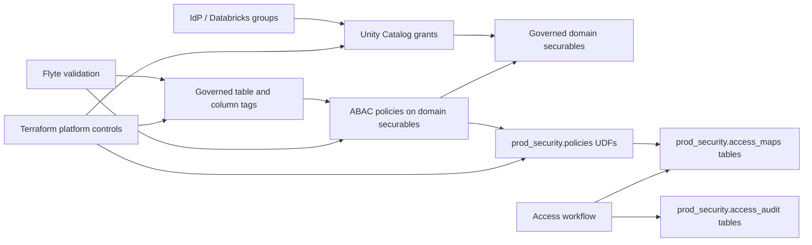

# Databricks ABAC Governance Design Doc

Status: draft for feedback

This design doc proposes future engineering work for a hybrid Databricks Unity Catalog RBAC and ABAC governance model. It condenses the current direction notes into a reviewable proposal for engineering, security/platform, application teams, and leadership.

# Problem Context

The current Databricks access model uses Unity Catalog grants, workspace assignments, workspace entitlements, and Databricks groups for baseline access. That is the right foundation for coarse access, but it does not scale cleanly for high-cardinality row and column access patterns.

For example, Jira project row access should not require one Databricks group per Jira project key. That would create group sprawl, unclear ownership, and noisy review paths as projects and memberships change. At the same time, replacing groups entirely with user-level rows would duplicate identity-system membership and create operational churn.

The opportunity is to layer ABAC on top of existing RBAC:

- RBAC answers: "Can this principal query this catalog, schema, or table?"
- ABAC answers: "Which protected rows or columns can this principal see inside that object?"
- Access workflows answer: "Who approved this fine-grained access and why?"

This proposal is directional. It does not approve live Terraform resources or queue implementation work by itself.

# Proposed Solution

Build toward a layered Unity Catalog governance model:

- Terraform owns stable platform controls: catalogs, schemas, governed tags, allowed values, grants, policy definitions, reusable policy-supporting UDFs, and deployment hooks or definitions for access mapping objects.
- Application teams own data production and domain logic inside governed tables.
- Security/platform teams own reusable access-control primitives and validation expectations.
- Access workflows own fine-grained access decisions, approval history, and materialization of effective access facts.
- Flyte validates runtime object conformance after application teams produce tables.

The model introduces a platform governance catalog, `prod_security`, for shared ABAC support objects. ABAC policies attach to governed domain securables at the highest safe scope, while reusable policy-supporting UDFs live in `prod_security.policies`.

# Goals and Non-Goals

- Avoid high-cardinality Databricks group sprawl for row and column access.
- Preserve coarse RBAC through Unity Catalog grants and Databricks groups.
- Centralize reusable ABAC policy support in `prod_security`.
- Make ABAC participation explicit through table-level governed tags and protected column tags.
- Keep access mapping tables narrow and optimized for query-time policy checks.
- Split validation by ownership: Terraform for static platform invariants, Flyte for runtime object conformance.
- Keep approval history separate from hot-path access mapping tables.

## Non-Goals

- Do not implement Terraform resources as part of this design doc.
- Do not define exact table DDL for access mapping tables.
- Do not decide the physical source/effective access-map layout.
- Do not replace IdP groups, Databricks groups, or Unity Catalog grants.
- Do not make Jira a special implementation target. Jira is an example.
- Do not resolve leadership decisions around `prod_security.reference.*` visibility or promotion blocking.

# Design

## Top-Level Model



The key separation is that policies attach to the protected domain surface, but reusable policy logic and support data live in the platform governance catalog.

## Platform Governance Catalog

`prod_security` is a platform governance catalog, not a normal governed domain catalog. It does not inherit normal domain-reader access semantics.

Conceptual schema layout:

| Namespace | Mostly Contains | Meaning |
| --- | --- | --- |
| `prod_security.access_maps.*` | tables | Current effective access facts used by policy checks |
| `prod_security.access_audit.*` | tables | Approval ledgers, revocations, and change history |
| `prod_security.reference.*` | tables | Governance reference data |
| `prod_security.policies.*` | functions/UDFs | Policy-supporting functions called by ABAC policies |

Normal consumers should not directly read `prod_security.access_maps.*` or `prod_security.access_audit.*`. Consumer-facing audit or reporting should use safe views only if a future spec defines them.

Visibility for `prod_security.reference.*` is an open leadership decision.

## ABAC Policy Scope

ABAC policies should be defined at the highest safe Unity Catalog scope:

- Catalog-level when the rule, tag vocabulary, target principals, and exceptions are consistent across the catalog.
- Schema-level when the rule is tied to a bounded layer or area such as `raw`, `final`, or a domain-specific schema.
- Table-level only for exceptional, migration, non-reusable, or one-off cases.

Broad-scope policies must be constrained by governed tags through `WHEN` and `MATCH COLUMNS` conditions.

ABAC policies are platform controls even when attached to domain catalogs, schemas, or tables. Terraform owns stable policy definitions. Flyte may validate Terraform-owned policies, but should not mutate them.

## Policy-Supporting UDFs

Reusable policy-supporting UDFs live in `prod_security.policies`.

Domain-specific UDFs should be rare. They require a future scoped spec proving that the rule is genuinely domain-specific and defining ownership, validation, and lifecycle.

Defaulting to centralized reusable UDFs avoids divergent policy behavior across domains.

## ABAC Participation Contract

A catalog or schema can contain both ABAC-governed and ordinary tables. A table is not automatically governed just because it is created inside a catalog or schema with ABAC policies.

Every table intended to participate in ABAC must have:

- a table-level governed tag declaring that the table is inside the ABAC governance boundary
- protected column tags on fields that require specific policy behavior

The table-level tag answers: "Is this table intentionally inside the governed ABAC surface?"

The column-level tag answers: "Which data element requires specific policy behavior?"

Validation should fail when the contract is inconsistent, for example:

- a column has a protected column tag but the table lacks the table-level governed tag
- the table has the governed tag but required policy or grant wiring is missing
- the table claims to be governed but protected column tags are incomplete or invalid
- a deployment path explicitly says the catalog or schema only accepts governed tables and an ungoverned table is created there

## Access Mapping Tables

Access mapping tables live under `prod_security.access_maps.*`. They are scoped by access decision shape, not by individual resource and not by one generic catch-all model.

Preferred grain examples:

- `prod_security.access_maps.jira_project_access`
- `prod_security.access_maps.user_region_access`
- `prod_security.access_maps.customer_account_access`

Access mapping tables should expose conceptual minimum fields, without standardizing exact DDL:

- principal identity for authored rules or effective user identity for runtime policy checks
- protected resource key
- access level or decision
- active or effective-time state
- source decision ID linking back to an access workflow or approval ledger

`access_level` is a positive access decision such as `read`, `masked`, or `admin_view`. The default pattern is allow-only. Deny rows should be avoided unless a future spec defines conflict-resolution rules for overlapping mappings.

Access mappings need an effective-time model, but this design does not prescribe lifecycle columns. A future spec may use `is_active`, `valid_from`, `expires_at`, SCD records, event-derived materialization, or another design.

## Access Mapping Principals

Access mapping tables may use group principals when the group represents a durable, governance-owned access role.

Group principals are allowed for stable role-based access. User principals are reserved for explicit exceptions, temporary access, or break-glass cases.

Good group-principal examples:

```text
finance_us_analysts -> US data
finance_eu_analysts -> EU data
```

Bad group-principal examples:

```text
jira_project_ABC_readers -> Jira project ABC
jira_project_DEF_readers -> Jira project DEF
```

ABAC policy UDFs should read materialized effective user access from `prod_security.access_maps.*`. They should not routinely resolve group membership dynamically at query time.

The physical access-map design is intentionally deferred. A future spec may choose one table, multiple tables, views, materialized tables, or another shape, as long as it preserves these principles:

- authored rules may use durable group principals
- policy UDFs read materialized effective user access
- access mapping objects remain under `prod_security.access_maps.*`

## Access Workflow and Audit

Access workflows own fine-grained access decisions. They materialize current effective access facts into access mapping tables and record approval or revocation history in audit tables.

Access mapping tables are enforcement indexes, not approval ledgers. They should not carry approval comments, full workflow history, Jira metadata, or other wide audit payloads.

Detailed approval metadata belongs in `prod_security.access_audit.*`, including approver, reason, request history, revocation history, and full audit trail.

## Validation Model

Terraform validates static platform invariants it can know before runtime tables are produced:

- governed tag definitions
- allowed values
- catalog and schema configuration
- policy definitions
- expected grants
- reusable UDF references and prerequisites

Flyte validates runtime object conformance after application teams produce tables:

- actual table tags
- actual protected column tags
- policy applicability
- access-map behavior
- evidence that governed objects match declared intent

Terraform should not validate tags on tables it does not create or own.

## Deployment Ordering

Conceptual deployment order:

1. Platform governance catalog and schemas exist.
2. Governed tags and allowed values exist.
3. Policy-supporting UDFs exist in `prod_security.policies`.
4. Access mapping table contracts exist under `prod_security.access_maps`.
5. Domain tables are produced and tagged.
6. ABAC policies are attached to the highest safe domain securable.
7. Runtime validation checks tags, policy applicability, and access-map behavior.

Partial deployment can create confusing or unsafe states, such as protected column tags without table-level ABAC participation tags, policies without supporting UDFs, or governed tables whose access-map behavior cannot be validated.

## Jira Example

Jira project row access is an example of the general pattern.

Coarse RBAC grants a group access to the `prod_jira` domain. ABAC row filtering then consults a narrow access mapping table such as `prod_security.access_maps.jira_project_access`.

A Jira table participates in ABAC only when it has a table-level governed tag. The Jira project key column has a protected column tag. A policy attached at the highest safe scope calls a reusable UDF in `prod_security.policies`.

If a principal has coarse `prod_jira` access but no effective access mapping row for a Jira project key, row access fails closed to zero rows.

# Alternatives Considered

## One Group Per Resource

Creating groups such as `jira_project_ABC_readers` avoids access mapping tables, but creates high-cardinality group sprawl and pushes row-level authorization into the identity system.

## User-Only Access Mapping Tables

User-only maps are explicit but duplicate group membership, create churn during onboarding and offboarding, and make reviews harder when many users share the same role-based access.

## One Generic Access Table

A single `all_access` table is flexible, but it becomes semantically vague, hard to validate, and hard to optimize for policy checks.

## Domain-Local Policy UDFs

Putting UDFs in every domain catalog gives teams local control, but increases the risk of divergent policy behavior and unclear ownership.

## Table-Level ABAC Policies Only

Table-level policies are simple to reason about locally, but they do not scale well and miss the value of tag-constrained catalog or schema policies.

# Open Questions

- When must runtime validation evidence block production promotion for tables inside the ABAC governance boundary? This requires a leadership decision.
- What is the visibility model for `prod_security.reference.*`? This requires a leadership decision.
- Which exact governed tag names and allowed values should represent ABAC participation and protected column semantics?
- What physical design should access maps use: one table, multiple tables, views, materialized tables, or another shape?
- Which first domain should be used for a future prototype or implementation spec?
- What evidence should Flyte publish for successful and failed ABAC validation runs?

# Parties Involved

- Security/platform: owns reusable access-control primitives, policy-supporting UDF standards, and validation expectations.
- Data platform: owns Terraform integration, Flyte validation design, and deployment sequencing.
- Application/data teams: own domain table production, table contracts, and model-local tag intent.
- IAM/identity owners: own durable group membership and identity lifecycle.
- Leadership/governance: decides promotion-blocking risk posture and reference-data visibility.

# Timeline and Milestones

This document does not set dates. A future implementation plan should use milestones similar to:

1. Align on open leadership decisions.
2. Define governed tag vocabulary and ABAC participation contract.
3. Write scoped specs for `prod_security`, access map contracts, reusable UDFs, and validation evidence.
4. Prototype one narrow access decision shape in a non-production path.
5. Validate performance, auditability, and fail-closed behavior.
6. Decide rollout criteria for additional domains.

# Appendix

- [Architecture](../../ARCHITECTURE.md)
- [RBAC and ABAC ownership strategy](../../rbac-abac-direction.md)
- [Databricks infrastructure access-control context](../../CONTEXT.md)
- [ADR 0001: Use `prod_security` as the Platform Governance Catalog](../adr/0001-platform-governance-catalog.md)
- [Databricks ABAC chat transcript](../../databricks_abac_chat_transcript.md)
